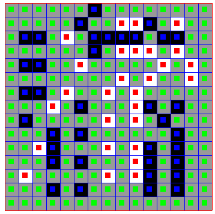

# `yin-yang-extractor`

This is a Rust program to extract Yin-Yang puzzles from images.

## Usage

The CLI tool is only built if the `cli` flag is enabled. Use `cargo build -F cli
--release` to build the release version of the CLI tool and run it with
`./target/release/yin-yang-extract <OPTIONS>`, or use `cargo run -F cli
--release -- <OPTIONS>` to do both. It expects a single positional argument with
a path to an image file. The `--debug-output` argument is an optional path to a
`.png` file where an image with some analysis annotations will be written. Use
the `RUST_LOG` environment variable to control logging.

Example usage:

```
$ cargo run -F cli --release -- --debug-output example-output.png testcases/06-15x15-squares.png
    Finished `release` profile [optimized] target(s) in 0.04s
     Running `target/release/yin-yang-extract --debug-output example-output.png testcases/06-15x15-squares.png`
. . . . . . B . . . . . . . .
. . . . . B . . W W B . W . .
. B B . W . B B B B . B B . .
. . . . . . B . W W W . W . .
. B B . . W . . . . . W . W .
. . . . . . . . W . W . . W .
. B B . W . . W . W . . . . .
. . . W . B . . . W B . B . .
. B . . . . . W . W . B . . .
. . . B . B . . . . . . B . .
. . W B . . . W . W B . B . .
. . . B . B . . . W B . B . .
. W . . . . . W . W B . B . .
. . . B . B . . . . B . B . .
. . . . . . . . . . . . . . .
```

This produces the following image in `example-output.png`:



## How it works

The analysis works in a few passes.

### Preprocessing

The image is first converted to grayscale and averaged along each of the X and Y
axes, producing a single column which is the average of all the columns in the
image, and a single row which is the average of all the rows in the image,
called the reduced column and reduced row. A Laplace filter is applied to each
of these, stored in `laplace`, and the square and autocorrelation are calculated
and stored in `laplace_sq` and `laplace_autocorr`. This analysis is performed by
`analyze_grid_common`.

### Cell size detection

The cell size is referred to as the "grid pitch" in the code, and this pass is
performed by `analyze_grid_pitch`. The analysis looks for peaks in
`laplace_autocorr`:

- Start with the `argmax` of `laplace_autocorr` as the first pitch estimate.
- Check if half the initial estimate also seems to be a peak. For some inputs
  the second peak is as much as 3 times bigger than the first peak and this is a
  hack to make sure we don't miss the first peak. If it looks like a peak, then
  take that as the initial estimate.
- Look at integer multiples of the initial pitch estimate to further refine it.
  The grid pitch in the image may not be an integer pixel count, so by looking
  for later peaks we can calculate a fractional pitch estimate.

The pitch estimates from both axes are averaged into a single number on the
assumption that grid cells are squares.

### Grid bounds detection

The grid bounds parameters for each axis are a pixel offset and a cell count.
For each axis, the analysis pass in `analyze_grid_bounds` scores every
reasonable combination of offset and cell count and picks the result with the
best score. An offset and cell count are scored by thresholding `laplace_sq` on
its mean and summing up the values that appear on the grid cell boundaries
generated by the parameters.

### Cell analysis

With the grid bounds and cell size known, `analyze_cells` converts the subimage
for each cell into a flat vector and sorts them into 3 classes with k-means.
The meaning of the classes is determined in the next step.

### Puzzle analysis

This is the final analysis step that determines the meaning of the classes
determined in the previous step. `analyze_puzzle` creates 3 grids from the cell
classes, one for each choice of class to represent empty cells. The choice of
which of the remaining classes represents black or white cells does not affect
the correctness of the result since the rules of Yin-Yang are symmetric to color
exchange, but `analyze_puzzle` chooses the one with a darker centroid to
represent black, and the remaining class is white.

The 3 puzzle grids are then tested for validity by checking if they contain a
solid 2x2 of non-empty cells. The assumption is that the empty cells in the
input image will have a 2x2 somewhere in them, which is overwhelmingly common
for Yin-Yang puzzles in their fully unsolved state. When this is the case, only
one of the grids will be valid, and this is the grid returned as output.

## Known limitations

- The cell size detection and grid bounds detection are very fiddly. For best
  results, the input image should be cropped as close as possible to the puzzle
  grid itself.
- The k-means in the cell analysis step is wrong sometimes, e.g. putting all
  empty and white cells into one class and splitting the black cells into the
  other two classes. This could possibly be improved by running k-means multiple
  times or by choosing a different analysis strategy, but it works well enough
  at the moment.